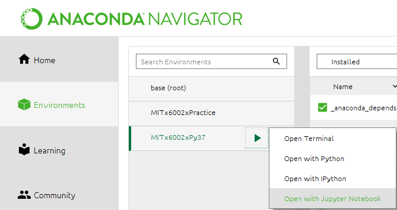
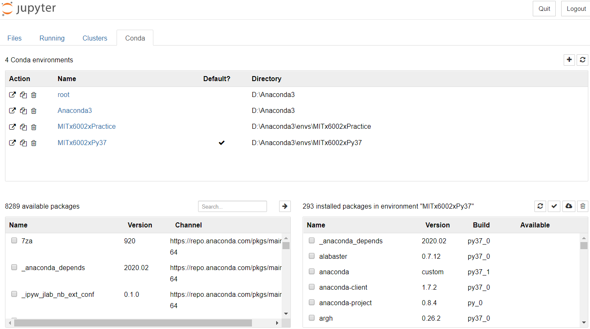

# MITx 6.00.2x
[Introduction to Computational Thinking and Data Science - EdX](https://www.edx.org/course/introduction-to-computational-thinking-and-data-4)

## Objectives

1. To record my study notes
2. To organize my thought process and attempts at solving the problems 
3. To maintain accountability with weekly to-do lists and track progress

## Tools

1. Jupyter Notebook
2. Jekyll or some other static pages for blogging
3. Python 3.7
4. Virtual Environment in anaconda (set to Python 3.7)
5. ```nb_conda``` to manage conda environment-based kernels inside the Jupyter Notebook

## Todos

- [x] Set up local git repo
- [ ] Research and set up TTD in Python
- [x] Create virtual environment for practice exercises, homework, problems, midterm and exams
- [x] Set up anaconda so it will open jupyter notebook in the folder of the virtual environment instead of ```C:/Users/<username>```

## Setup

### [Virtual Environment](https://uoa-eresearch.github.io/eresearch-cookbook/recipe/2014/11/20/conda/)

```conda update conda```

```conda create -n yourenvname python=x.x anaconda```

```source activate yourenvname``` or ```conda activate yourenvname```

Conda activate is faster since conda 4.4

Activating a conda environment modifies the PATH and shell variables to point to the specific isolated Python set-up you created. The command prompt will change to indicate which conda environemnt you are currently in by prepending (yourenvname).

To install extra Python packages ```conda install -n yourenvname [package]```

To deactivate the environment ```conda deactivate```

To remove the environment ```conda remove -n yourenvname --all```

#### Name
MITx6002xPy37

#### Directory
```.../MITx6.00.2x/Practice```

#### Third-party libraries
```path_to_your_anaconda_location/anaconda/envs/yourenvname```

#### Check all environments
```conda info -e```

### Jupyter Notebook

#### Setup for Jupyter Notebook to automatically manage new environments

After activating the conda environment, run ```conda install nb_conda```

Then run ```python -m ipykernal install --user --name=yourenvname```

It will return the directory where ipykernel stores the kernelspec of the new virutal environment. The message may look like below

``Installed kernelspec MITx6002xPractice in C:\Users\<username>\AppData\Roaming\jupyter\kernels\<yourenvname>``

(Optional) [Change the default directory of jupyter notebook launched in Anaconda Navigator](https://www.planetofbits.com/python/change-jupyter-notebook-startup-folder-anaconda/)

   1. Open Anaconda Navigator -> Environments
   2. Click on any ▶ button and choose ```Open Terminal```
   3. Type in ```jupyter notebook --generate-config```
   4. Move to where the file  ```jupyter_notebook_config.py``` was written and type ```start .```
   5. Open the file in an editor
   6. Find the line ```#c.NotebookApp.notebook_dir``` and uncomment it by removing **#**
   7. Add the new directory where you want to the base folder of jupyter notebook to be located upon being launched. The line should now look something like ```c.NotebookApp.notebook_dir = 'D:\Python3'```
   
#### Start Jupyter Notebook from Anaconda Navigator (recommended)

1. Start Anaconda Navigator
2. Click on ```Environments``` on the left panel
3. Click on the ▶ next to the environment you want to open jupyter notebook in that environment (must have nb_conda installed already)



4. Open the ```Conda``` tab to check that the virtual environment is displayed in jupyter notebook
   


5. Go back to the ```Files``` tab and create or open a .ipynb file. If you get stuck if your file is not on the disk where Anaconda launched your jupyter notebook, try [changing the default directory of jupyter notebook launched in Anaconda Navigator](https://www.planetofbits.com/python/change-jupyter-notebook-startup-folder-anaconda/) 

[More info](https://medium.com/@nrk25693/how-to-add-your-conda-environment-to-your-jupyter-notebook-in-just-4-steps-abeab8b8d084)

## Credit

I do not own any theories and exercises presented here. They were taken from the EdX course [Introduction to Computational Thinking and Data Science](https://www.edx.org/course/introduction-to-computational-thinking-and-data-4) and belong to the MIT and professors: 
   * John Guttag - Dugald C. Jackson Professor of Computer Science and Electrical Engineering
   * Eric Grimson - Bernard Gordon Professor of Medical Engineering; Professor of Computer Science
   * Ana Bell - Lecturer, Computer Science and Electrical Engineering

I only provided the solutions and some extra explanations. 